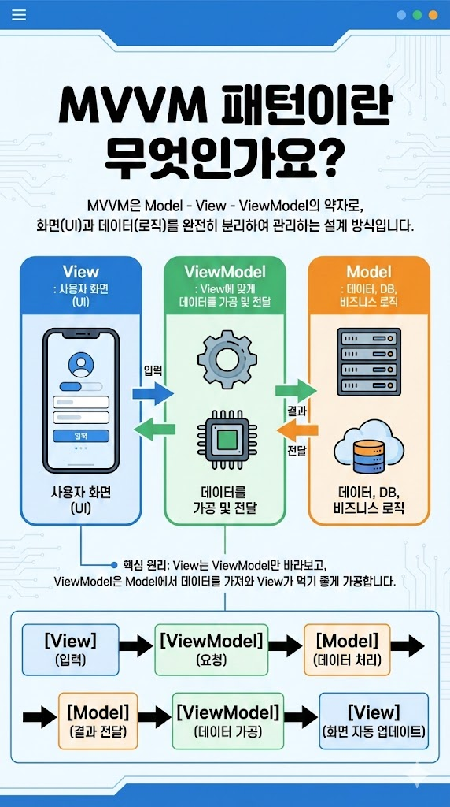

# MVVM 패턴이란 무엇인가요?
MVVM은 Model - View - ViewModel의 약자로, 화면(UI)과 데이터(로직)를 완전히 분리하여 관리하는 설계 방식입니다.

## MVVM의 3요소
- Model : "데이터, DB, 비즈니스 로직"
- View : 사용자 화면 (UI)
- ViewModel : View에 맞게 데이터를 가공 및 전달

- 핵심 원리: View는 ViewModel만 바라보고, ViewModel은 Model에서 데이터를 가져와 View가 먹기 좋게 가공합니다.
## 데이터 흐름
[View](입력) → [ViewModel](요청) → [Model](데이터 처리) → [Model](결과 전달) → [ViewModel](데이터 가공) → [View](화면 자동 업데이트)

