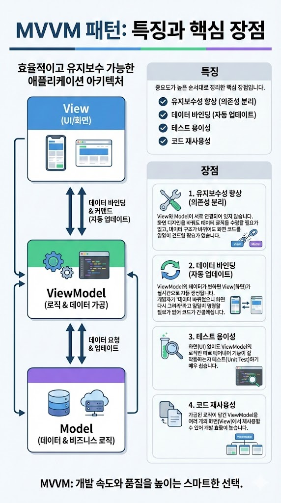

# MVVM 패턴의 특징과 장점은 무엇인가요?

## 특징
- 중요도가 높은 순서대로 정리한 핵심 장점입니다.

## 장점
- 유지보수성 향상 (의존성 분리)
View와 Model이 서로 연결되어 있지 않습니다. 화면 디자인을 바꿔도 데이터 로직을 수정할 필요가 없고, 데이터 구조가 바뀌어도 화면 코드를 일일이 건드릴 필요가 없습니다.

- 데이터 바인딩 (자동 업데이트)
ViewModel의 데이터가 변하면 View(화면)가 실시간으로 자동 갱신됩니다. 개발자가 "데이터 바뀌었으니 화면 다시 그려라"라고 일일이 명령할 필요가 없어 코드가 간결해집니다.

- 테스트 용이성
화면(UI) 없이도 ViewModel의 로직만 따로 떼어내어 기능이 잘 작동하는지 테스트(Unit Test)하기 매우 쉽습니다.

- 코드 재사용성
가공된 로직이 담긴 ViewModel을 여러 개의 화면(View)에서 재사용할 수 있어 개발 효율이 높습니다.

