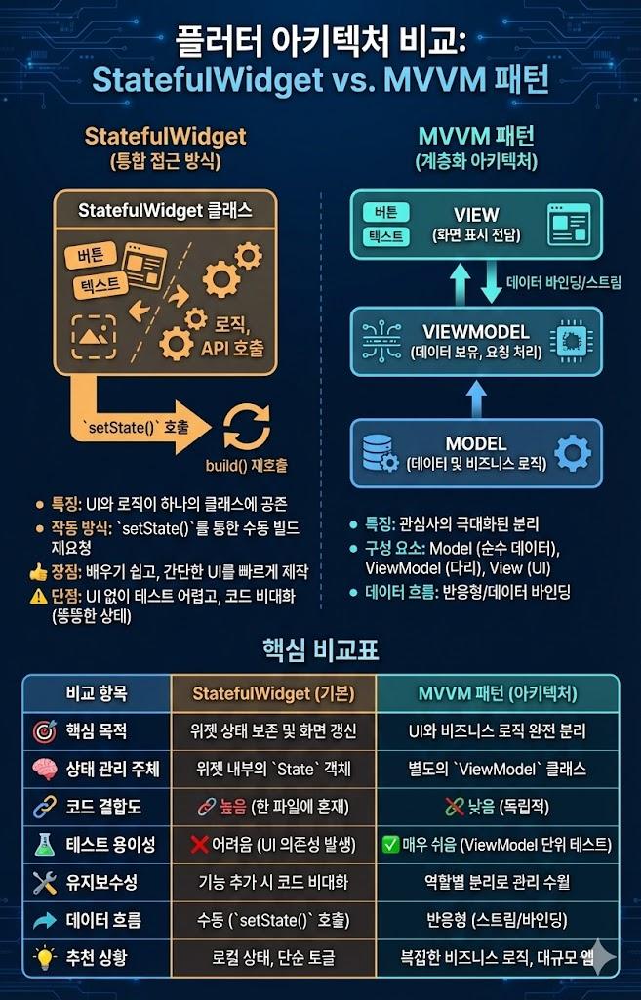

# MVVM 패턴과 StatefulWidget의 차이점을 설명하세요.

# StatefulWidget

## 특징
- UI선언과 상태 변경 로직이 하나의 클래스 안에 공존

## 작동방식
- setState() 호출시 Flutter에게 데이터가 바뀌었으니 build() 메서드 다시 호출해

## 장점
- 배우기 쉽고, 간단한 UI를 빠르게 만들 때 유리

## 단점
- API호출, 데이터 계산이 섞이면 코드가 매우 길어지고, UI없이 따로 테스트 하기 어려움

--- 

# MVVM

## 특징
- 관심사의 분리를 극대화

## Model
- 순수 데이터와 비지니스 로직을 담당
## View
- 화면만 보여주는 역할
## ViewModel
- View가 필요로 하는 데이터를 들고 있고 , View가 요청하면 Model을 업데이트

| 비교 항목 | StatefulWidget (Basic) | MVVM Pattern (Architecture) |
| :--- | :--- | :--- |
| **핵심 목적** | 위젯의 상태 보존 및 화면 갱신 | UI와 비즈니스 로직의 완전한 분리 |
| **상태 관리 주체** | 위젯 내부의 `State` 객체 | 별도의 `ViewModel` 클래스 |
| **코드 결합도** | **높음** (UI와 로직이 한 파일에 혼재) | **낮음** (UI와 로직이 독립적임) |
| **테스트 용이성** | **어려움** (로직 테스트 시 UI 의존성 발생) | **매우 쉬움** (ViewModel만 따로 단위 테스트 가능) |
| **유지보수성** | 기능이 많아질수록 코드가 비대해짐 (Fat State) | 기능별로 역할이 나뉘어 관리가 수월함 |
| **데이터 흐름** | `setState()`를 통한 수동 하향식 갱신 | 데이터 바인딩 또는 스트림을 통한 반응형 갱신 |
| **추천 상황** | 로컬 UI 상태, 단순한 토글, 단발성 입력 | 복잡한 비즈니스 로직, 대규모 데이터 처리 앱 |

