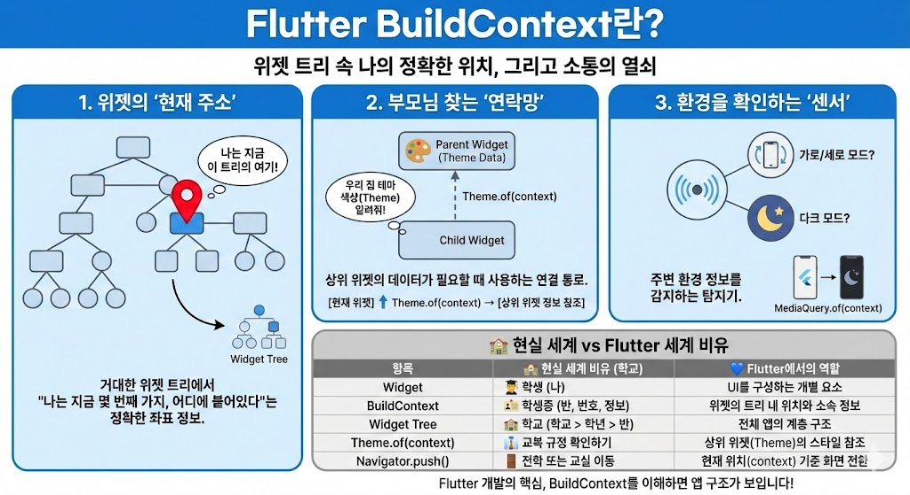

# Flutter에서 BuildContext 란 무엇인지 예시를 들어 설명해보세요.

## BuildContext란?
- 위젯의 '현재 주소' (Location)
    - Flutter는 수많은 위젯이 나무처럼 얽힌 '위젯 트리' 구조입니다.
    - context는 "나는 지금 이 트리의 몇 번째 가지, 어디에 붙어 있는 위젯이다"라는 정확한 위치 정보를 갖고 있습니다.

- 부모님을 찾는 '연락망' (Parent Reference)
    - 자식 위젯이 "우리 집 거실 벽지 색깔(Theme)이 뭐지?" 또는 "내 방 문(Scaffold) 좀 열어줘"라고 물어볼 때, context라는 연락망을 통해 상위 위젯의 정보를 찾아갑니다.

- 환경을 확인하는 '센서' (Environment)
    - "지금 화면이 가로인가 세로인가?", "다크모드인가?" 같은 주변 환경 정보를 context를 통해 감지합니다.

---

| 항목 | 현실 세계 비유 | Flutter에서의 역할 |
| :--- | :--- | :--- |
| **Widget** | 학생 (나) | UI를 구성하는 개별 요소 |
| **BuildContext** | 학생증 (반, 번호, 학교 정보) | 위젯의 트리 내 위치와 소속 정보 |
| **Widget Tree** | 학교 (학교 > 학년 > 반) | 전체 앱의 계층 구조 |
| **Theme.of(context)** | 교복 규정 확인 | 상위 위젯(Theme)의 스타일 데이터 참조 |
| **Navigator.push()** | 전학 또는 교실 이동 | 현재 위치(context) 기준으로 화면 전환 |
---

