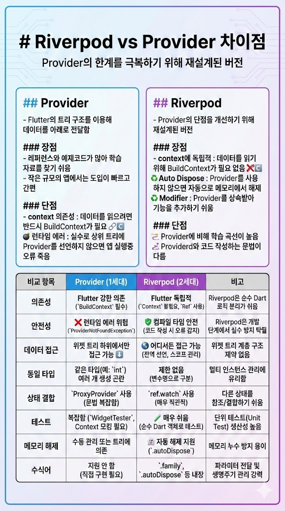

# Riverpod vs Provider 차이점

Provider의 한계를 극복하기 위해 재설계된 버전

---
## Provider
- Flutter의 트리 구조를 이용해 데이터를 아래로 전달함

### 장점
- 레퍼런스와 예제코드가 많아 학습 자료를 찾기 쉬움
- 작은 규모의 앱에서는 도입이 빠르고 간편

### 단점
- context 의존성 : 데이터를 읽으려면 반드시 BuildContext가 필요
- 런타임 에러 : 실수로 상위 트리에 Provider를 선언하지 않으면 앱 실행중 오류 죽음

---

## Riverpod
- Provider의 단점을 개선하기 위해 재설계된 버전

### 장점
- context에 독립적 : 데이터를 읽기 위해 BuildContext가 필요 없음
- Auto Dispose : Provider를 사용하지 않으면 자동으로 메모리에서 해제
- Modifier : Provider를 상속받아 기능을 추가하기 쉬움

### 단점
- Provider에 비해 학습 곡선이 높음
- Providerd와 코드 작성하는 문법이 다름

---

| 비교 항목 | Provider (1세대) | Riverpod (2세대) | 비고 |
| :--- | :--- | :--- | :--- |
| **의존성** | **Flutter 강한 의존** (`BuildContext` 필수) | **Flutter 독립적** (`Context` 불필요, `Ref` 사용) | Riverpod은 순수 Dart 로직 분리가 쉬움 |
| **안전성** | **런타임 에러 위험** (`ProviderNotFoundException`) | **컴파일 타임 안전** (코드 작성 시 오류 감지) | Riverpod은 개발 단계에서 실수 방지 탁월 |
| **데이터 접근** | 위젯 트리 **하위**에서만 접근 가능 | **어디서든** 접근 가능 (전역 선언, 스코프 관리) | 위젯 트리 계층 구조 제약 없음 |
| **동일 타입** | 같은 타입(예: `int`) 여러 개 생성 곤란 | **제한 없음** (변수명으로 구분) | 멀티 인스턴스 관리에 유리함 |
| **상태 결합** | `ProxyProvider` 사용 (문법 복잡함) | `ref.watch` 사용 (매우 직관적) | 다른 상태를 참조/결합하기 쉬움 |
| **테스트** | 복잡함 (`WidgetTester`, Context 모킹 필요) | **매우 쉬움** (순수 Dart 객체로 테스트) | 단위 테스트(Unit Test) 생산성 높음 |
| **메모리 해제** | 수동 관리 또는 트리에 의존 | **자동 해제** 지원 (`.autoDispose`) | 메모리 누수 방지 용이 |
| **수식어** | 지원 안 함 (직접 구현 필요) | `.family`, `.autoDispose` 등 내장 | 파라미터 전달 및 생명주기 관리 강력 |

---
