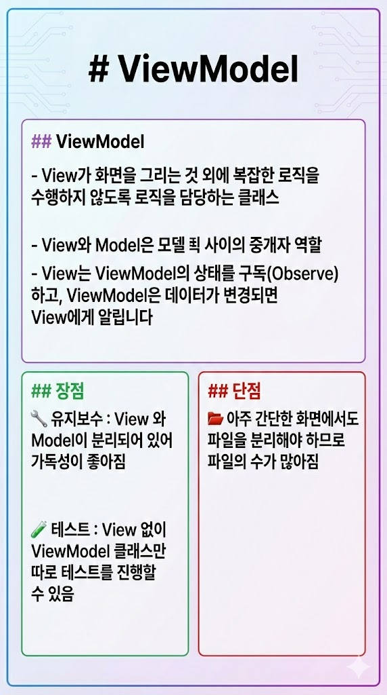

# ViewModel
- View가 화면을 그리는것 외에 복잡한 로직을 수행하지 않도록 로직을 담당하는 클래스
- View와 Model은 모델 사이의 중개자 역할
- View는 ViewModel의 상태를 구독(Observe)하고, ViewModel은 데이터가 변경되면 View에게 알립니다

## 장점
- 유지보수 : View 와 Model이 분리되어 있어 가독성이 좋아짐
- 테스트 : View 없이 ViewModel 클래스만 따로 테스트를 진행할 수 있음

## 단점
- 아주 간단한 화면에서도 파일을 분리해야 하므로 파일의 수가 많아짐

## 사용예시
```dart
// [View] : UI 코드 (User_View.dart)
// View는 오직 화면을 그리는 일과 사용자 입력을 ViewModel로 넘기는 일만 함
class UserView extends ConsumerWidget {
  @override
  Widget build(BuildContext context, WidgetRef ref) {
    final userState = ref.watch(userViewModelProvider); // 상태 구독

    return Scaffold(
      body: userState.isLoading 
          ? CircularProgressIndicator() 
          : Text(userState.name),
      floatingActionButton: FloatingActionButton(
        onPressed: () {
            // 로직은 직접 처리하지 않고 ViewModel에 요청
            ref.read(userViewModelProvider.notifier).fetchUser(); 
        },
      ),
    );
  }
}

// [ViewModel] : 비즈니스 로직 (User_ViewModel.dart)
// UI 요소(Context, Widget)를 전혀 몰라도 작동해야 함
class UserViewModel extends StateNotifier<UserState> {
  final Repository repository; // 데이터 소스 주입

  UserViewModel(this.repository) : super(UserState.initial());

  Future<void> fetchUser() async {
    state = state.copyWith(isLoading: true); // 로딩 상태 변경
    try {
      final user = await repository.getUser();
      state = state.copyWith(isLoading: false, name: user.name); // 데이터 반영
    } catch (e) {
      state = state.copyWith(isLoading: false, error: e.toString()); // 에러 처리
    }
  }
}
```
---
