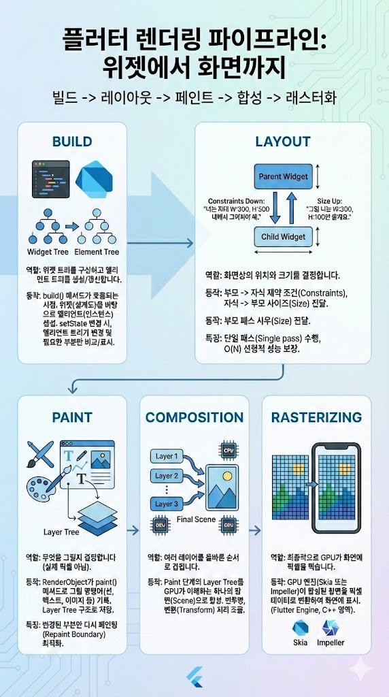

# 위젯이 화면에 그려지기까지의 과정을 설명해보세요. 
- Build -> Layout -> Paint -> Composition

## Build
- 역할: 위젯 트리를 구성하고 엘리먼트 트리를 생성/갱신합니다.

- 동작: build() 메서드가 호출되는 시점입니다. 개발자가 정의한 위젯(설계도)을 바탕으로 엘리먼트(인스턴스)가 생성됩니다. 만약 setState 등으로 상태가 변경되면, 엘리먼트 트리는 새 위젯과 기존 위젯을 비교하여 변경이 필요한 부분만 표시해 둡니다.

---
## Layout
- 역할: 화면상의 위치와 크기를 결정합니다.

- 동작: 부모에서 자식으로 **제약 조건(Constraints)**이 내려가고, 자식은 자신의 크기를 결정하여 부모에게 **사이즈(Size)**를 전달합니다.

- Constraints Down: "너는 최대 가로 300, 세로 500 내에서 그려져야 해."
- Size Up: "그럼 나는 가로 300, 세로 100만 쓸게요."

- 특징: 단일 패스(Single pass)로 수행되어 O(N)의 선형적인 성능을 보장합니다.

---
## Paint
- 역할: 무엇을 그릴지 결정합니다 (실제 픽셀을 찍는 것이 아님).

- 동작: RenderObject는 paint() 메서드를 통해 캔버스에 그릴 명령어(선 그리기, 텍스트 출력, 이미지 배치 등)를 기록합니다. 이 결과물은 Layer Tree라는 구조로 저장됩니다.

- 특징: 변경된 부분만 다시 페인팅(Repaint Boundary)하여 성능을 최적화합니다.

---
## Composition
- 역할: 여러 레이어를 올바른 순서로 겹칩니다.

- 동작: Paint 단계에서 생성된 Layer Tree를 GPU가 이해할 수 있는 하나의 장면(Scene)으로 합성합니다. 반투명 효과나 변환(Transform) 처리가 이 단계에서 최종 조율됩니다.

---
## Rasterizing
- 역할: 최종적으로 GPU가 화면에 픽셀을 찍습니다.

- 동작: GPU 엔진(Skia 또는 Impeller)이 합성된 장면을 받아 모니터의 픽셀 데이터로 변환하여 화면에 표시합니다. 이 과정은 Flutter 프레임워크(Dart 영역)가 아닌 엔진(C++ 영역)에서 수행됩니다.

