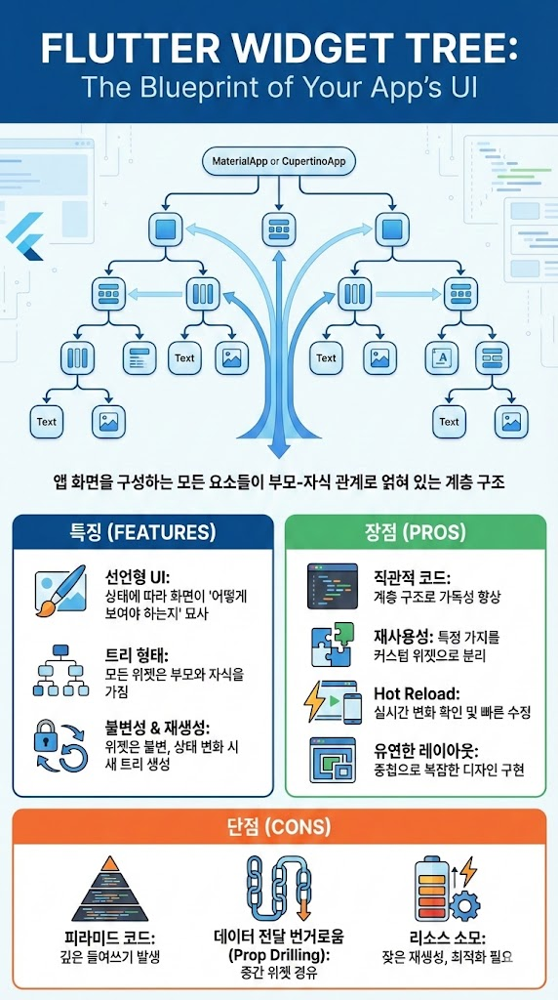

# Flutter에서 위젯트리란 무엇인가요? 
- 앱의 화면을 구성하는 모든 요소들이 부모-자섹 관계로 얽혀 있는 계층 구조

## 특징
- UI 화면이 어떻게 변해야 하는지가 아니라, 현재 상태에서 화면이 어떻게 보여야 하는지를 위젯들로 묘사합니다

- 모든 위젯은 부모가 있고, 하나 이상의 자식을 가질 수 있는 트리 형태를 띱니다.

- 위젯 자체는 한 번 생성되면 변하지 않습니다. 상태가 바뀌면 기존 위젯을 수정하는 게 아니라, 새로운 위젯 트리를 통째로 다시 생성합니다.

## 장점
- UI 구성 요소들이 계층적으로 나열되어 있어, 코드만 보고도 화면의 구조를 직관적으로 파악할 수 있습니다.

- 트리 내의 특정 가지를 별도의 커스텀 위젯으로 분리하여 다른 곳에서 쉽게 재사용할 수 있습니다.

- Hot Reload 기능을 통해 트리의 변화를 실시간으로 확인하며 빠르게 UI를 수정할 수 있습니다.

- 위젯을 중첩하는 것만으로도 매우 복잡하고 정교한 디자인을 쉽게 구현할 수 있습니다.

## 단점
- UI가 복잡해질수록 코드의 들여쓰기가 깊어져 이른바 '피라미드 코드'가 발생할 수 있습니다.

- 트리의 최하단 자식 위젯이 최상단 부모의 데이터가 필요할 때, 중간 단계의 위젯들을 거쳐 데이터를 전달해야 하는 번거로움이 생길 수 있습니다.

- 상태가 바뀔 때마다 트리가 다시 생성되므로, 최적화를 신경 쓰지 않으면 불필요한 리소스 소모가 발생할 수 있습니다.

